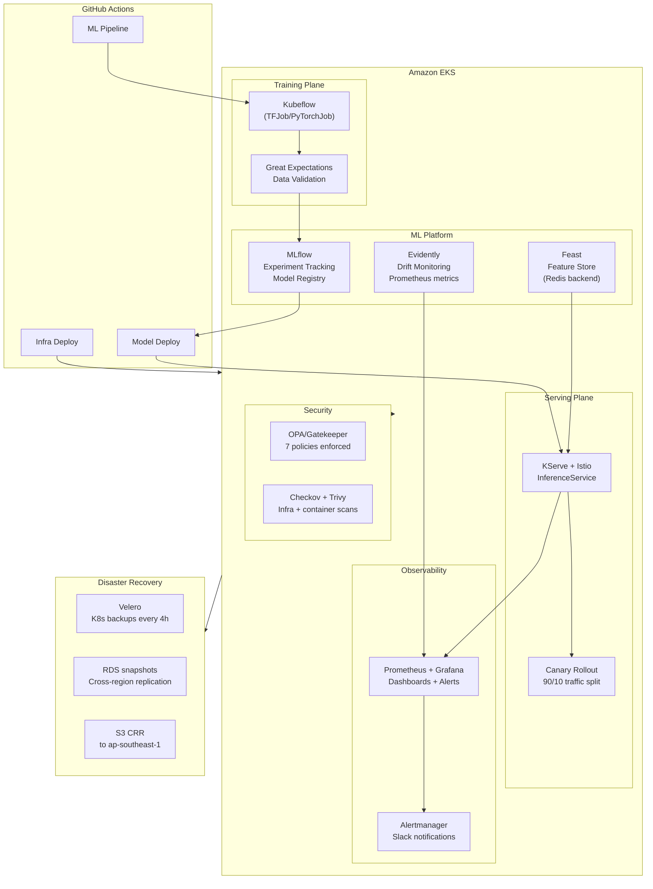

# MLOps K8s Platform

[](https://github.com/karthikk022/mlops-k8s-platform/actions/workflows/test.yml)

End-to-end production ML platform on Amazon EKS — automated training pipelines, feature store, model serving with canary rollouts, drift monitoring, and infrastructure-as-code. **19 passing tests covering the full ML lifecycle.**



## Features

| Capability | Tool | Description |
|------------|------|-------------|
| ML Pipeline | Kubeflow + Argo Workflows | Automated preprocessing → training → evaluation → promotion |
| Model Registry | MLflow | Experiment tracking, model versioning, S3 artifact store |
| Feature Store | Feast | Real-time feature serving with Redis online store |
| Model Serving | KServe + Istio | Serverless inference, canary rollouts, A/B testing, autoscaling (2–10 pods) |
| Drift Monitoring | Evidently + Prometheus | Data drift, model drift, target drift, Prometheus gauge exports |
| Infra-as-Code | Terraform + Crossplane | GitOps for EKS + ML platform across 3 environments |
| CI/CD | GitHub Actions | 5 workflows: test, train, infra-deploy, model-deploy, load-test |
| Security | Checkov + Trivy + OPA | IaC scanning, container vuln scanning, admission control (7 policies) |
| DR | Velero + RDS snapshots + S3 CRR | K8s backups (4h), RPO 15min, cross-region replication |

## Prerequisites

| Tool | Version | Purpose |
|------|---------|---------|
| AWS CLI | ≥ 2.0 | EKS management, S3, RDS |
| Terraform | ≥ 1.5 | Infrastructure provisioning |
| kubectl | ≥ 1.28 | K8s cluster management |
| Helm | ≥ 3.12 | MLflow, Feast, Evidently deployment |
| Python | ≥ 3.11 | ML pipeline scripts |
| Docker | ≥ 24.0 | Model server container builds |

## Quick Start (Local)

Generate synthetic data and run the full training pipeline locally — no cluster needed:

```bash
# Install dependencies
pip install -r serving/model-server/requirements.txt
pip install pytest pyyaml scikit-learn pandas pyarrow

# Generate sample data
python data/generate_sample_data.py --output /tmp/mlops-data

# Preprocess and train
export MLFLOW_ALLOW_FILE_STORE=true
python -c "
from data.generate_sample_data import generate_loan_default_data
from ml_pipeline.preprocessing.preprocess import preprocess
from ml_pipeline.training.train import train

generate_loan_default_data('/tmp/mlops-data')
preprocess('/tmp/mlops-data/dataset.parquet', '/tmp/preprocessed', 0.2, 'label')

config = {
    'tracking_uri': '',
    'experiment_name': 'loan-default',
    'data': {
        'train_path': '/tmp/preprocessed/train.parquet',
        'test_path': '/tmp/preprocessed/test.parquet',
        'target_column': 'label'
    },
    'model': {
        'type': 'gradient_boosting',
        'params': {'n_estimators': 100, 'max_depth': 4}
    },
    'register_model': False
}
train(config)
"

# Run all 19 tests
python -m pytest tests/ -v --tb=short
```

## Setup (Full Deployment)

```bash
# 1. Clone and configure
git clone https://github.com/karthikk022/mlops-k8s-platform.git
cd mlops-k8s-platform

# 2. Provision EKS cluster + ML platform
make setup-cluster          # or: cd infrastructure/terraform/environments/dev && terraform apply

# 3. Deploy ML components
make deploy-all             # MLflow + Feast + Evidently via Helm

# 4. Run training pipeline
make pipeline-compile       # Compile Kubeflow DAG
make pipeline-run           # Upload and execute on Kubeflow

# 5. Deploy model with canary
make deploy-model           # KServe InferenceService
make deploy-canary          # Istio 90/10 traffic split + Argo Rollout

# 6. Verify
make test-endpoint          # Smoke tests against deployed model

# 7. Monitor
make port-forward-grafana   # Grafana at localhost:3000
make port-forward-mlflow    # MLflow UI at localhost:5000
```

## Project Structure

```
mlops-k8s-platform/
├── .github/workflows/          # CI/CD automation (5 workflows)
│   ├── test.yml                # PR validation — lint + 19 tests
│   ├── ml-pipeline.yml         # Training pipeline — validate → build → train → register
│   ├── infra-deploy.yml        # Terraform plan/apply — dev/staging/prod matrix
│   ├── model-deploy.yml        # Canary deploy on MLflow registry tag
│   └── load-test.yml           # Weekly k6 load tests (soak + stress)
│
├── infrastructure/             # Infrastructure-as-Code
│   ├── terraform/              # EKS + addons for 3 environments
│   │   ├── environments/       # dev (~$200/mo), staging (~$500/mo), prod (~$3K/mo)
│   │   └── modules/            # eks, istio, kserve, mlflow, monitoring
│   ├── helm/                   # Custom Helm charts
│   │   ├── mlflow/             # MLflow tracking server (PostgreSQL + S3)
│   │   ├── feast/              # Feature store (Redis online store)
│   │   └── evidently/          # Drift monitoring service
│   └── crossplane/             # Platform API — XEKSCluster, XMLServingEnvironment
│
├── ml-pipeline/                # ML Training Pipeline
│   ├── preprocessing/          # Feature engineering (imputation, encoding, scaling)
│   ├── training/               # Model training with MLflow + CV (GB, RF)
│   ├── evaluation/             # Model evaluation with accuracy/precision gates
│   └── pipeline.py             # Kubeflow DAG — 4-component pipeline
│
├── serving/                    # Model Serving
│   ├── model-server/           # Custom KServe handler with MLflow loading
│   └── InferenceService.yaml   # Serverless 2–10 pods, HPA, probes
│   └── canary-rollout.yaml     # Istio 90/10 + Argo Rollout (10% → 30% → 60% → 100%)
│
├── monitoring/                 # Observability
│   ├── evidently/              # Drift monitor — Prometheus metrics exporter
│   ├── alerts/                 # PrometheusRule — 12 alerts (infra + model drift)
│   └── dashboards/             # Grafana — infrastructure + model performance
│
├── feature-store/              # Feast Feature Store
│   ├── feature_definitions.py  # 24 features across 3 feature views
│   ├── materialize.py          # Offline → online store materialization
│   └── feast-config/           # feature_store.yaml (Redis online store)
│
├── tests/                      # 19 Tests
│   ├── test_training_e2e.py    # 6 end-to-end tests (data gen → train → evaluate → serve)
│   ├── test_configs.py         # 7 YAML/JSON validation tests
│   ├── test_ml_pipeline.py     # 6 ML pipeline unit tests
│   └── test_infra.sh           # Shell-based infrastructure validation
│
├── data/                       # Synthetic data generation
├── examples/                   # Reference ML examples (iris, sentiment)
├── load-testing/               # k6 scripts (model-serving, mlflow, feast, soak, stress)
├── backup-dr/                  # Velero, RDS snapshots, S3 CRR
├── security/                   # Checkov config, Trivy config, Gatekeeper policies
├── secrets/                    # AWS Secrets Manager + Vault HA configuration
└── tls/                        # cert-manager + Let's Encrypt + HTTPS ingresses
```

## Testing

| Suite | Tests | Commands |
|-------|-------|----------|
| **End-to-end** | 6 | `make test-e2e` — generates data, preprocesses, trains GB/RF, evaluates, tests handler |
| **Config validation** | 7 | `make test-yaml` — parses all YAML/JSON, validates InferenceService/canary/Helm/Gatekeeper/monitoring |
| **ML pipeline** | 6 | `make test-python` — AST compilation, syntax checks, Dockerfile presence, handler structure |
| **Infrastructure** | shell | `make test-infra` — file existence, shebangs, Helm chart structure, Dockerfiles |

```bash
# Run all tests (19 Python + shell infra)
make test-all

# Or individually
make test-e2e       # End-to-end with real model training
make test-python    # Python unit tests
make test-yaml      # YAML/JSON parsing
make test-infra     # Infrastructure validation
```

## CI/CD Pipelines

| Workflow | Trigger | Stages | Duration |
|----------|---------|--------|----------|
| `test.yml` | PR to `main` | shellcheck → hadolint → 19 tests | ~3 min |
| `ml-pipeline.yml` | Push to `ml-pipeline/**` | Validate → Build → Trivy scan → Train → Register | ~15 min |
| `infra-deploy.yml` | Push to `infrastructure/**` | Terraform plan → Checkov → Trivy → Apply → Helm → Gatekeeper → Crossplane → cert-manager → Velero | ~20 min |
| `model-deploy.yml` | MLflow tag / manual | Deploy staging → Canary promote → MLflow tag | ~10 min |
| `load-test.yml` | Weekly (Mon 6AM) | Model → MLflow → Feast → Soak (70min) → Stress (9min) | ~90 min |

## Makefile Commands

```text
make setup-cluster        Provision EKS + install all ML components
make infra-plan           terraform plan for target environment
make infra-apply          terraform apply for target environment
make deploy-mlflow        Deploy/upgrade MLflow via Helm
make deploy-feast         Deploy/upgrade Feast via Helm
make deploy-evidently     Deploy/upgrade Evidently via Helm
make pipeline-compile     Compile Kubeflow pipeline DAG
make pipeline-run         Upload and run pipeline on Kubeflow
make deploy-model         Deploy KServe InferenceService
make deploy-canary        Deploy canary rollout (90/10 traffic split)
make test-endpoint        Smoke tests against deployed model
make scan-checkov         Checkov on Terraform configs
make scan-trivy           Trivy misconfig scan (HIGH/CRITICAL)
make port-forward-grafana  Grafana at localhost:3000
make port-forward-mlflow   MLflow UI at localhost:5000
make backup-all           Velero + RDS backups
make restore-all          Full DR restore
make k6-model             k6 load test — model serving
make k6-soak              k6 sustained load (70 min)
make test-all             Run all local validation tests
make clean                Remove caches and temp files
```

## Environments

| Env | Instance | Nodes | Spot | Monthly Cost | Purpose |
|-----|----------|-------|------|-------------|---------|
| dev | m6i.large → xlarge | 2–4 | Yes | ~$200 | Experimentation |
| staging | m6i.xlarge → 2xlarge | 3–8 | Yes | ~$500 | Pre-prod validation |
| prod | m6i.2xlarge → 4xlarge | 5–15 | OD + SP | ~$3,000 | Production workloads |

## Security & Compliance

- **OPA/Gatekeeper** (7 policies): required labels, resource limits, no privileged containers, no latest tag, probes required, no host network, min replicas ≥ 2
- **Checkov**: Terraform/K8s/Dockerfile misconfiguration scanning
- **Trivy**: Vulnerability + secret + misconfig scanning (HIGH/CRITICAL only)
- **Secrets**: AWS Secrets Manager or Vault HA (Raft + KMS auto-unseal) with database + AWS secrets engines
- **TLS**: cert-manager + Let's Encrypt (prod) with Route53 DNS01 solver across all ingresses
- **Audit**: MLflow tracks full experiment lineage; Crossplane enforces platform standards
- **Backup**: Velero (4h K8s snapshots, 30-day retention), RDS automated snapshots (15-min RPO), S3 CRR to ap-southeast-1

## Architecture

See [ARCHITECTURE.md](ARCHITECTURE.md) for detailed design decisions, training/serving plane diagrams, and observability stack.

## License

MIT
